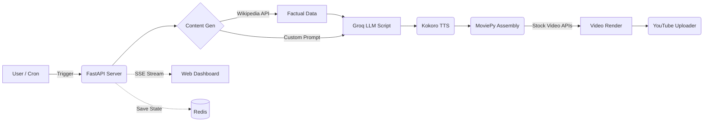

# 🎬 Autonomous AI Video Studio


A fully autonomous, open-source AI video generation pipeline and interactive web studio. This project automatically crafts highly-engaging vertical videos (YouTube Shorts/TikToks/Reels) by synthesizing Wikipedia articles, generating scripts via Groq, producing cinematic voiceovers with Kokoro TTS, assembling the video with MoviePy, and natively uploading them to YouTube as private drafts.

It operates in two modes:
1. **Interactive Studio Mode**: A sleek, dark-mode FastAPI dashboard to generate videos on-demand from specific niches.
2. **Headless Cron Mode**: An infinite-running background loop for "set-and-forget" daily video generation.

---

## ✨ Key Features

- 🧠 **Dynamic Niche Generation**: Fetch real, factual data directly from the Wikipedia API for True Crime, History, Geography, or True Love. No hallucinated content.
- 📝 **Groq Llama 3 Scripting**: Uses the insanely fast Groq API to craft viral, 8-to-12 scene scripts precisely timed for 60-90 second vertical videos.
- 🗣️ **Emotional Kokoro TTS**: Next-gen text-to-speech engine using local Kokoro models. Features dynamic speed, volume, and emotional tone adjustment based on Vader Sentiment analysis of the script.
- 🎞️ **Automated Assembly**: Uses `moviepy` and headless Chrome (Playwright) to stitch audio, stock video, and professional word-by-word karaoke captions.
- 🗄️ **Redis State Management**: Robust state tracking preventing duplicate Wikipedia stories, scaling gracefully across reloads.
- 📤 **YouTube Auto-Upload**: Direct integration with the Google Cloud YouTube Data API v3 to upload your final renders.

---

## ⚙️ Architecture

The pipeline consists of modular steps, coordinated asynchronously by `src/api/server.py`:



---

## 🚀 Quick Start Guide

### 1. Prerequisites

You will need the following installed:
- Python 3.10+
- FFmpeg (must be in your system PATH)
- Redis Server (local or via Docker)

### 2. Installation

Clone the repository and install the Python dependencies:

```bash
git clone https://github.com/yourusername/ai-video-studio.git
cd ai-video-studio

# Create and activate a virtual environment (recommended)
python -m venv venv
source venv/bin/activate  # On Windows: venv\Scripts\activate

# Install requirements
pip install -r requirements.txt
```

### 3. Setup Redis

The studio uses Redis to track state (e.g., ensuring you don't repeat the same Wikipedia mystery twice). If you don't have Redis installed, simply use the provided Docker Compose file:

```bash
docker-compose up -d
```
*This exposes Redis on `localhost:6379`.*

### 4. Configuration

1. Copy the environment template:
   ```bash
   cp .env.example .env
   ```
2. Open `.env` and add your **Groq API Key**. You can get one for free at [console.groq.com](https://console.groq.com).
3. If you want automatic YouTube uploads, obtain OAuth credentials from Google Cloud Console, save them as `client_secret.json` in the root directory, and run `python -m src.services.youtube` once to generate a permanent `token.json`.

---

## 🖥️ Usage

### Interactive Web Studio

To launch the real-time creation dashboard:

```bash
python -m uvicorn src.api.server:app --reload
```
Navigate to **http://localhost:8000/** in your browser. 
From the dashboard, you can trigger True Crime mysteries, History explainers, or type a custom manual story. The live progress bar will track the script, voiceover generation, and rendering via SSE streaming.

### Headless CLI Mode

To run a single automated generation loop directly from the terminal (ideal for a daily cron job):

```bash
python -m src.main
```

---

## 🛡️ Important Notes & Disclaimers

- **YouTube Policy**: Be aware of YouTube's "Repetitious Content" policy. While this tool automates production, you should strive to add unique value, custom prompts, and creative editing parameters to ensure your content remains authentic and monetizable.
- **Model Sizes**: The Kokoro TTS engine requires downloading `.onnx` and `.bin` weights on first run, which may take a few minutes depending on your internet connection.
- **API Limits**: The Groq API free tier allows ~1000 requests a day. This pipeline uses 1 request per video, making it effectively free forever.

---

## 🤝 Contributing

Contributions, issues, and feature requests are welcome!
Feel free to check [issues page](https://github.com/yourusername/ai-video-studio/issues) if you want to contribute.

## 📝 License

This project is [MIT](LICENSE) licensed.
